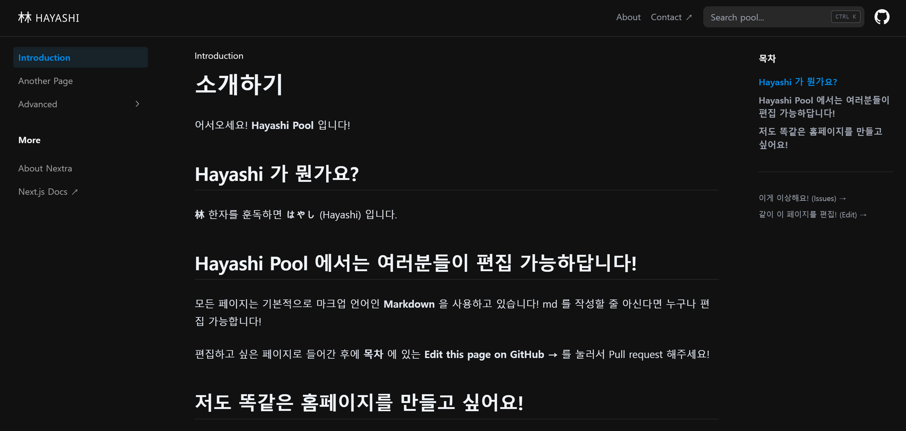

# Hayashi Blog

This is a blog created with [Nextra](https://nextra.site).

[**Live Demo →**](https://hayashi-pool.vercel.app/)

## Local Development

1. 노드 설치 https://nodejs.org/
2. pnpm 설치 https://pnpm.io/ko/installation
3. run `pnpm i` to install the dependencies.
4.  run `pnpm dev` to start the development server and visit localhost:3000.

## 개발 참고 문서
1. https://nextra.site/docs/docs-theme
2. https://mdxjs.com/docs/
3. https://nextjs.org/docs

## License

This project is licensed under the MIT License.
